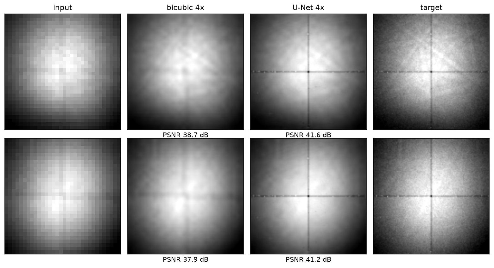

# ImageUpscale

[](https://github.com/NikNord174/ImageUpscale/actions/workflows/ci.yml)

4x super-resolution of EBSD diffraction patterns with a U-Net.

An EBSD detector in a scanning electron microscope records thousands of
Kikuchi diffraction patterns per scan. Recording them at low resolution
makes the scan much faster, at the cost of pattern detail. This project
trains a U-Net to restore 4x-downsampled patterns back to full
resolution, so a scan could be acquired fast and upscaled afterwards.

This is a demo version of the project: a compact, self-contained slice
of a larger body of work, sized so that everything here (training,
evaluation, tests) reproduces on a single laptop.



*Held-out scan, never seen in training. The patterns are private lab
data (polycrystalline nickel), so the repo ships no data or weights;
the figure and the table below come from `scripts/evaluate.py` run
against that scan.*

## How it works

- **Data.** Patterns are read straight from `.up2` files, the EDAX
  binary format: a 16-byte header (version, pattern width, pattern
  height, byte offset) followed by back-to-back 16-bit patterns.
  `src/datatools/up_dataset.py` memory-maps the file, so a
  multi-gigabyte scan costs almost no RAM. Patterns are 16-bit and stay
  16-bit: values are scaled to float straight from uint16, never
  squeezed through a uint8 path.
- **Training pairs.** Self-supervised: each pattern resized to
  128x128 is the target, and the target average-pooled 4x4 is the
  32x32 input. Block averaging rather than smooth resampling, because
  binning is what the detector actually does when it trades
  resolution for speed. It also keeps the task honest: a smoothly
  downsampled image keeps so much information that bicubic
  interpolation is nearly optimal, while binned patterns leave the
  network something real to recover. No labels are needed; the pair
  comes from the pattern itself.
- **Model.** A U-Net (`src/models/unet.py`) with a twist: the encoder
  halves the resolution four times, but the first two decoder stages
  upsample 4x instead of 2x. The decoder ends up two doublings ahead of
  the encoder, which is where the 4x super-resolution comes from. Skip
  tensors are zero-padded up to the decoder resolution before
  concatenation. The network predicts a residual on top of bicubic
  upsampling of its input: interpolation recovers the smooth structure
  for free, and the model competes only on the remaining detail.
- **Training.** The loss is MSE plus a windowed-SSIM term. MSE on its
  own tends toward the blurry average of all plausible
  reconstructions; the SSIM term penalizes the loss of local
  structure. AdamW, `pytorch-argus` loop with early stopping,
  best-checkpoint saving, LR reduction on plateau, and CSV logging.
  Model selection monitors SSIM on a *held-out scan*: a different
  scan of the sample rather than a slice of the training one, since
  neighbouring points of one scan sit in the same grain and look
  nearly identical.
- **Metrics.** Two SSIM variants live in `src/metrics/ssim.py`: the
  standard 11x11 Gaussian-windowed SSIM (used in the loss and in the
  results below, comparable to published numbers) and a cheap
  whole-image-statistics variant used as the per-epoch training
  monitor.

## Results

Trained on one full scan (4,512 patterns, 25 epochs on a laptop GPU),
evaluated on all 3,936 patterns of a second scan of the same sample
covering different grains. The two scans share only the static
detector background: after flat-fielding, validation patterns have no
close match in the training scan (best cross-scan correlation 0.33),
so the score cannot come from memorizing training content.

|                        | PSNR (dB) | windowed SSIM |
|------------------------|-----------|---------------|
| bicubic 4x             | 38.0      | 0.898         |
| U-Net, MSE loss        | 39.1      | 0.912         |
| U-Net, MSE + SSIM loss | 40.8      | 0.936         |

Both models beat interpolation on every single held-out pattern, and
each design decision is an ablation row: without the residual
connection the network *loses* to bicubic on every pattern, and the
SSIM term adds 1.7 dB over the MSE-only loss while visibly restoring
structure (the detector seam and its bright pixels) that MSE alone
smooths away. `python -m scripts.evaluate <scan.up2> --checkpoint
<model.pth> --figure docs/results.png` reproduces the table and the
figure for any checkpoint.

**Training setup.** Apple-silicon laptop (`mps` device), no discrete
GPU: 25 epochs over 4,512 patterns at batch size 32 take a bit under
two hours, about 4.5 minutes per epoch including the full validation
pass. AdamW at lr 1e-3, halved after 8 epochs without improvement;
early stopping at 15; the best checkpoint by held-out SSIM is kept
(epoch 24 in this run). The same command finishes in minutes on a
CUDA machine.

## Run it

Needs Python 3.11+. Training runs on CUDA, Apple Silicon (`mps`) or CPU.

```
git clone https://github.com/NikNord174/ImageUpscale
cd ImageUpscale
pip install -r requirements.txt
python -m scripts.train
```

Point the config at your own `.up2` scans first — either edit
`configs/train_configs.yaml` or override on the command line:

```
python -m scripts.train \
    'data.train=["data/scan6.up2"]' \
    'data.valid=["data/scan5.up2"]' \
    model.params.device=mps
```

Checkpoints, logs and the resolved config land in
`data/experiments/<experiment>_<run>/`.

With Docker (GPU host): `make build && make run`.

## Tests

`make test` — the suite runs without any pattern data: it writes a tiny
synthetic `.up2` file and checks the parser, the pair shapes, 16-bit
value preservation, the 4x output geometry of the model, a full
CPU training step, and the SSIM metric. `make lint` runs flake8.

## Limitations

- Both scans are the same material (nickel) on the same instrument;
  cross-material generalization is untested.
- The binning model covers the resolution loss but not the change in
  noise statistics a genuinely faster exposure would bring.
- The restored patterns are smoother than the raw targets: the
  network restores structure and, by design, leaves the shot noise
  out.
